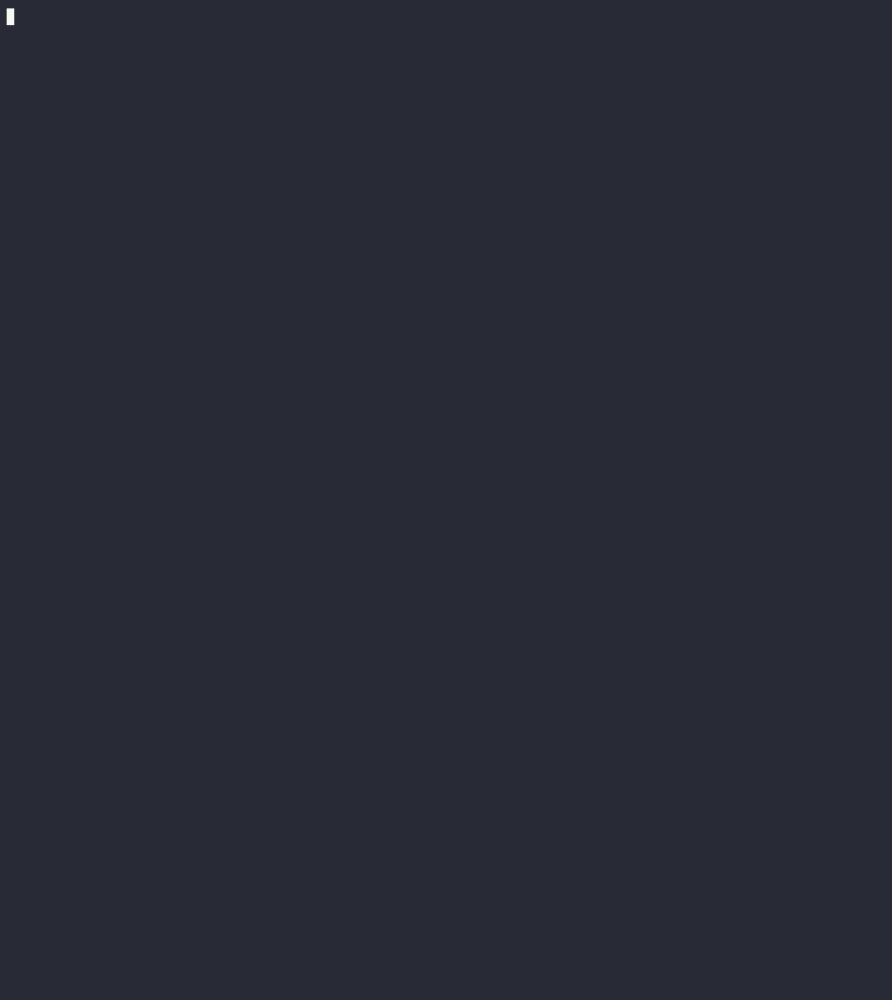

# Commit Companion


This is a simple CLI tool that gets the git diff of the staged files and generates a commit message through one of the [supported models from Perplexity AI](https://docs.perplexity.ai/docs/model-cards).

Highly inspired by [AI Commits](https://github.com/Nutlope/aicommits), where I get the prompt for the commit message and the diff of the staged files.

## Installation
```bash
npm install -g @razorsim/commit-companion
```

## Usage
After the installation, you can use the command `commit-companion` inside a git repository with staged files.

Before the first usage, you need to run the `setup` command to configure your options. You'll be able to set a provider, the API key (if needed) and the model name.

As of now, every provider that implements the OpenAI API should work.

### Models

Example setup:
```bash
# Guided setup
commit-companion setup
# Using arguments
commit-companion setup -u <your endpoint URL> -k <your API KEY> -m <model name>
```

To generate the commit message:
```bash
commit-companion generate
```

Optionally, you can use the `--semantic` flag if you want to use the semantic commit message format.

```bash
# 
commit-companion generate --semantic
```

## Pitfalls
- The commit message is generated based on the diff of the staged files. If you have a lot of changes, the commit message might not be the best. I'm working on a better way to generate the commit message.


## Contributing
If you want to contribute, please open an issue or a pull request. I'm open to suggestions and improvements.

First of all, clone the repository and install the dependencies. The `.nvmrc` file points to the latest correct Node.js version:

```bash
nvm use # or fnm use
corepack install
pnpm install
```

Then, you can run the app in `watch` mode:
```bash
pnpm build:watch
```

You can use biome to lint/check/format the code:
```bash
pnpm biome:check
pnpm biome:format
pnpm biome:lint
```
